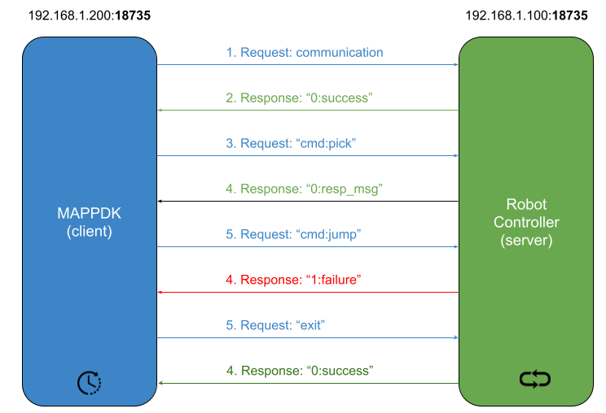

# fanucpy
# The Python package to facilitate online robot programming for FANUC industrial robots

## Software contents
The package consists of two parts: 
1. Robot interface code written in Python programming language
2. FANUC robot controller driver (tested with R-30iB Mate Plus Controller) written in KAREL and FANUC teach pendant languages

The communication protocol between the Python package and the FANUC robot controller is depicted below:


## Driver installation
Follow these [steps](fanuc.md) to install FANUC driver.

## Usage
### Connect to a robot:
```python
from Robot import Robot

robot = Robot(
    robot_model="Fanuc",
    host="192.168.1.100",
    port=18735,
    ee_DO_type="RDO",
    ee_DO_num=7,
)

robot.connect()
```

### Moving
```python
# move in joint space
robot.move(
    "joint",
    vals=[19.0, 66.0, -33.0, 18.0, -30.0, -33.0],
    velocity=100,
    acceleration=100,
    cnt_val=0,
    linear=False
)

# move in cartesian space
robot.move(
    "pose",
    vals=[0.0, -28.0, -35.0, 0.0, -55.0, 0.0],
    velocity=50,
    acceleration=50,
    cnt_val=0,
    linear=False
)
```

### Opening/closing gripper
```Python
# open gripper
robot.gripper(True)

# close gripper
robot.gripper(False)
```

### Querying robot state
```python
# get robot state
print(f"Current pose: {robot.get_curpos()}")
print(f"Current joints: {robot.get_curjpos()}")
print(f"Instantaneous power: {robot.get_ins_power()}")
```

## Acknowledgements
This work was developed at the [Institute for Advanced Manufacturing at the University of Nottingham](https://www.nottingham.ac.uk/ifam/index.aspx) as a part of the [Digital Manufacturing and Design Training Network](https://dimanditn.eu/).

This project has received funding from the European Union’s Horizon 2020 research and innovation programme under the Marie Skłodowska-Curie grant agreement No 814078.